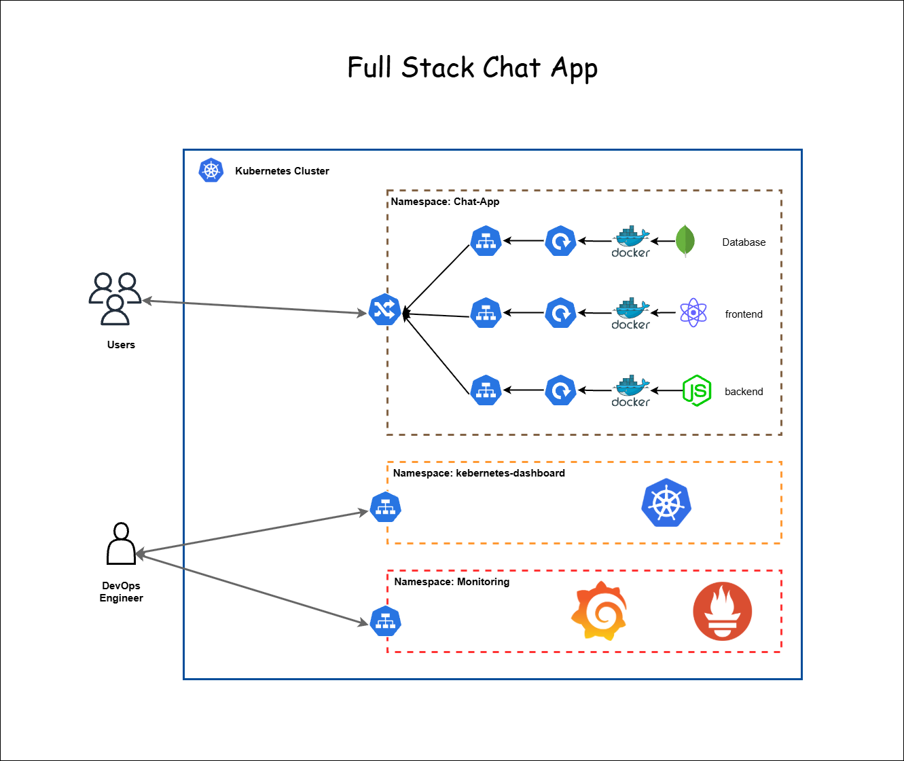

# ChatApp on Minikube with Monitoring

This project demonstrates the deployment of a **3-tier Chat
Application** on **Kubernetes (Minikube)** with monitoring and
observability using **Prometheus** and **Grafana**. Additionally, it
integrates the **Kubernetes Dashboard** for cluster management.

------------------------------------------------------------------------

## 📌 Architecture Overview

The architecture follows a **3-tier design**:



1.  **Frontend**
    -   Built with a web framework (e.g., React/Angular).
    -   Runs as a Kubernetes Deployment and exposed via a **Service
        (NodePort/ClusterIP)**.
    -   Accessible via Ingress on `http://localhost`.
2.  **Backend**
    -   A REST API (Node.js/Flask/Django etc.) running in Kubernetes.
    -   Handles application logic and communicates with MongoDB.
    -   Exposed internally via Kubernetes Service and externally via
        Ingress on `http://localhost/api`.
3.  **Database (MongoDB)**
    -   Runs as a Kubernetes Deployment/StatefulSet with a persistent
        volume.
    -   Exposed as a **ClusterIP Service** (internal only).
    -   The backend communicates with MongoDB via its service name.
4.  **Ingress Controller**
    -   **NGINX Ingress Controller** is used for routing traffic:
        -   `/` → Frontend
        -   `/api` → Backend
5.  **Monitoring Stack**
    -   **Prometheus** collects metrics from the cluster and pods.
    -   **Grafana** visualizes metrics via dashboards.
    -   Both deployed in Minikube.
6.  **Kubernetes Dashboard**
    -   Provides a web UI for managing Kubernetes resources.

------------------------------------------------------------------------

## 🚀 Deployment Steps

### 1. Start Minikube

``` bash
minikube start --driver=docker
```

### 2. Enable NGINX Ingress

``` bash
minikube addons enable ingress
```

### 3. Deploy Namespace

``` bash
kubectl create namespace chat-app
```

### 4. Deploy MongoDB

``` bash
cd kubernetes
kubectl apply -f mongodb-pv.yml
kubectl apply -f mongodb-pvc.yml
kubectl apply -f deployment-mongoDB.yml
kubectl apply -f mongodb-service.yml
```

### 5. Deploy Frontend

``` bash
cd kubernetes
kubectl apply -f deployment-frontend.yml
kubectl apply -f frontend-service.yml
```

### 6. Deploy Backend

``` bash
cd kubernetes
kubectl apply -f secret.yml
kubectl apply -f deployment-backend.yml
kubectl apply -f backend-service.yml
kubectl apply -f ingress.yml

```

### 7. Run Ingress service

``` bash

 kubectl port-forward service/ingress-nginx-controller -n ingress-nginx 80:80

```


### 8. Deploy Monitoring Stack (Prometheus & Grafana)

You can use Helm or `kube-prometheus-stack`.

``` bash
helm repo add prometheus-community https://prometheus-community.github.io/helm-charts
helm repo update
helm install monitoring prometheus-community/kube-prometheus-stack -n monitoring --create-namespace
```

### 9. Access Services

-   **Frontend:** `http://localhost`

-   **Backend API:** `http://localhost/api`

-   **Kubernetes Dashboard:**

    ``` bash
    minikube dashboard
    ```

-   **Prometheus:**

    ``` bash
    kubectl port-forward svc/monitoring-kube-prometheus-prometheus 9090:9090 -n monitoring
    ```

    Open `http://localhost:9090`

-   **Grafana:**

    ``` bash
    kubectl port-forward svc/monitoring-grafana 3000:80 -n monitoring
    ```

    Open `http://localhost:3000` (default user: `admin`, password:
    `prom-operator`).

------------------------------------------------------------------------

## 📊 Monitoring Metrics

-   **Prometheus** scrapes metrics from:
    -   Kubernetes components (API Server, Kubelet, etcd)
    -   Application Pods (if instrumented)
-   **Grafana** visualizes metrics like:
    -   CPU & Memory usage
    -   Pod/Node health
    -   Network I/O
    -   Custom application metrics

------------------------------------------------------------------------

## ✅ Future Improvements

-   Add Persistent Volume for MongoDB.
-   Use **Helm charts** for easier deployment.
-   Implement CI/CD pipeline (Jenkins/GitHub Actions).
-   Add **Alertmanager** with Prometheus for alerting.
-   Secure Ingress with TLS.

------------------------------------------------------------------------


## 🙌 Contributors

-   **Muhammad Umer** -- Cybersecurity Graduate \| DevOps Enthusiast
